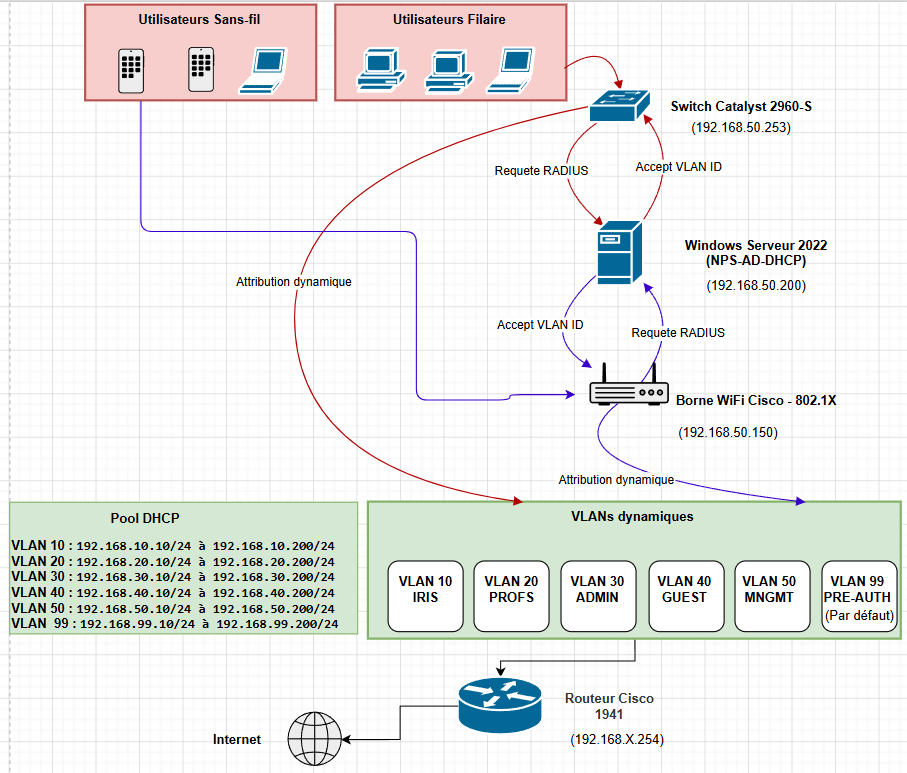

# Dossier de choix technique - RP01

> **Auteur :** Edib Saoud  
> **Période :** 10/11/2025 - 12/04/2026  
> **Objectif :** Sécuriser les accès filaires et Wi-Fi via 802.1X + RADIUS/NPS + AD.

---

## 1. Besoin initial et contraintes

### 1.1 Besoin métier

Le besoin était de remplacer un modèle permissif (clé Wi-Fi partagée et ports filaires peu contrôlés) par :
- une **authentification nominative** ;
- une **traçabilité** des connexions ;
- une **segmentation automatique** selon le profil utilisateur.

### 1.2 Contraintes du projet

- Environnement pédagogique mixte (Windows + Cisco + Debian).
- Cohabitation filaire et Wi-Fi.
- Maintien de service pendant la migration.
- Pas d'exposition des secrets dans la documentation.

---

## 2. Architecture retenue

### 2.1 Chaîne AAA

1. **Supplicant** : poste client Windows / smartphone.
2. **Authenticator** : switch Cisco (`SW1-IRIS`) ou AP Cisco (`AP1-IRIS`).
3. **Serveur RADIUS** : NPS sur Windows Server 2022 (`192.168.50.200`).
4. **Source d'identité** : Active Directory `iris.local`.

### 2.2 Méthode d'authentification

- **EAP :** PEAP + EAP-MSCHAPv2.
- **Certificat serveur :** certificat local NPS (présenté dans le tunnel PEAP).
- **Décision d'accès :** policies NPS basées sur groupes AD.
- **Action NPS :** injection des attributs de tunnel VLAN (10/20/30).

---

## 3. Modèle AD et segmentation dynamique

### 3.1 Structure AD (implémentée)

- Forêt / domaine : `iris.local` (niveau fonctionnel Windows 2016).
- OU principales : `Iris_Lab`, `SISR`, `SLAM`, `Administration`.
- Exemples d'utilisateurs : `edib`, `yanis.adidi`.

### 3.2 Groupes AD utilisés par NPS

| Groupe AD | Usage | VLAN attribué |
|:--|:--|:--:|
| `G_VLAN10_Iris` | Étudiants | 10 |
| `G_VLAN20_Profs` | Profs | 20 |
| `G_VLAN30_Admin` | Administration | 30 |

> Pas de policy NPS dédiée Guest/Pre-Auth dans l'implémentation validée.

---

## 4. Plan d'adressage et rôles réseau

| VLAN | Nom | Sous-réseau | Passerelle VIP | DHCP |
|:--:|:--|:--|:--|:--|
| 10 | IRIS | `192.168.10.0/24` | `192.168.10.254` | `192.168.10.10 - 192.168.10.200` |
| 20 | Profs | `192.168.20.0/24` | `192.168.20.254` | `192.168.20.10 - 192.168.20.200` |
| 30 | Admin | `192.168.30.0/24` | `192.168.30.254` | `192.168.30.10 - 192.168.30.200` |
| 40 | Guest | `192.168.40.0/24` | (routé via R1) | Selon DHCP central |
| 50 | Management | `192.168.50.0/24` | `192.168.50.254` | `192.168.50.100 - 192.168.50.150` |
| 99 | Pre-Auth | VLAN de quarantaine | N/A | N/A |

### Équipements clés

| Hôte | Adresse |
|:--|:--|
| `SRV-ADNPS-IRIS` | `192.168.50.200` |
| `SW1-IRIS` | `192.168.50.253` |
| `R1-IRIS` | `192.168.50.251` (+ VIP `.254`) |
| `AP1-IRIS` | `192.168.50.150` |
| `debian-rp` (services) | `192.168.50.100` / `192.168.50.252` |

---

## 5. Justification des choix techniques

| Choix | Justification | Limite |
|:--|:--|:--|
| NPS intégré à AD | Cohérence Microsoft, gestion centralisée des identités | Dépendance forte au serveur AD/NPS |
| PEAP-MSCHAPv2 | Déploiement rapide sans certificat client | Moins fort qu'EAP-TLS |
| VLAN dynamique par groupe AD | Segmentation automatique, moins d'erreurs d'admin | Exige des policies NPS rigoureuses |
| VLAN 99 en pré-auth | Empêche l'accès métier avant auth | Nécessite contrôle strict des ports |
| Double serveur RADIUS déclaré côté Cisco (`.200` + `.100`) | Continuité de service / tolérance | Complexifie le dépannage |

---

## 6. Services complémentaires intégrés

### 6.1 DHCP + VRRP

- `debian-rp` : Kea DHCP + Keepalived (instances VRRP 10/20/30/50).
- `R1-IRIS` : sous-interfaces 802.1Q et VRRP avec VIP `.254`.
- Objectif : maintenir une passerelle virtuelle stable par VLAN.

### 6.2 NTP

- NTP configuré sur switch, AP et routeur (sources internes `.200` / `.100`).
- Objectif : horodatage fiable pour logs et audit.

### 6.3 TFTP (backup de configuration)

- `archive path tftp://192.168.50.100/...` présent sur R1, SW1 et AP1.
- Objectif : sauvegarde automatique des configurations à chaque `write-memory`.

### 6.4 Syslog / SNMP

- Envoi des logs Cisco vers `192.168.50.100`.
- SNMP activé pour supervision locale (communautés à masquer dans la doc publique).

---

## 7. Schéma d'architecture

---

## 8. Risques et mesures

| Risque | Impact | Mesure appliquée |
|:--|:--:|:--|
| Mauvaise policy NPS | Élevé | Ordre des policies contrôlé + tests comptes valides/invalides |
| Désynchronisation horaire | Moyen | NTP interne configuré sur tous les équipements |
| Perte de configuration Cisco | Élevé | Archive TFTP automatique |
| Fuite de secrets | Élevé | Masquage des clés/mots de passe dans la documentation |
