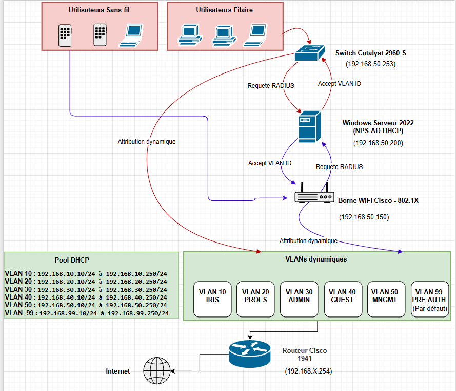

# Dossier de Choix Technique - Accès Réseau 802.1X

> **Auteur :** Edib Saoud
> **Date :** 10/11/2025 - 12/04/2026
> **Version :** 1.0
> **Statut :** Validé

---

## 1. Contexte et Problématique

L'infrastructure réseau de l'école IRIS Mediaschool souffrait de deux vulnérabilités principales :
- Les ports Ethernet des salles de cours n'étaient pas sécurisés. N'importe qui pouvait brancher un appareil non autorisé et obtenir un accès au réseau.
- Le réseau Wi-Fi reposait sur une clé pré-partagée (WPA-PSK), rendant la gestion des départs fastidieuse et la traçabilité des actions réseau impossible.

L'objectif était de contraindre chaque équipement à s'authentifier de manière transparente via l'Active Directory avant de se voir attribuer un accès physique (Couche 2 OSI).

---

## 2. Choix Technologiques

### 2.1 Architecture AAA (Authentication, Authorization, Accounting)

L'architecture s'appuie sur trois composants :
1. **Le Supplicant :** Le PC client (Windows 10/11) doté du service `Wired AutoConfig` pour gérer le protocole EAP.
2. **L'Authentificateur (Client RADIUS) :** Les Switchs et Points d'Accès Cisco qui bloquent les ports en attente d'une validation.
3. **Le Serveur d'Authentification (Serveur RADIUS) :** Un serveur Windows Server 2022 hébergeant le rôle **NPS (Network Policy Server)** couplé à la base Active Directory.

### 2.2 Protocole d'Authentification : PEAP-MS-CHAP v2
La méthode **PEAP** a été choisie car elle crée un tunnel TLS sécurisé protégeant la phase d'authentification sans nécessiter de déployer un certificat lourd sur chaque poste client (seul le serveur NPS en a besoin). L'utilisateur s'authentifie ainsi classiquement avec son login/mot de passe Active Directory.

---

## 3. Plan d'Adressage et Segmentation (VLANs)

Afin de garantir la performance et la sécurité, une affectation dynamique des VLANs a été mise en place via NPS (selon l'appartenance de l'utilisateur à un groupe AD).

| VLAN ID | Nom du VLAN | Description / Cible |
|:---:|:---|:---|
| **VLAN 10** | IRIS | Étudiants de l'école IRIS. Accès aux ressources pédagogiques limitées. |
| **VLAN 20** | Profs | Personnel enseignant. Accès élargi aux ressources. |
| **VLAN 30** | Administration | Personnel administratif. Accès aux bases de données et applications sensibles. |
| **VLAN 40** | Guest | Visiteurs. Accès Internet uniquement. |
| **VLAN 50** | Management | Réseau d'administration (`192.168.50.x`). Strictement réservé à l'équipe IT. |
| **VLAN 99** | PRE_AUTH | VLAN par défaut et trou noir (isolation) pour les postes en attente d'authentification. |

### IP des Équipements (Management)
- **Windows Server (NPS) :** `192.168.50.200`
- **Switch Cisco :** `192.168.50.253`
- **Routeur Physique :** `192.168.50.254`
- **AP Wi-Fi Cisco :** `192.168.50.150`

---

## 4. Schéma de l'Architecture Globale

---

## 5. Analyse des Risques

| Risque Identifié | Impact | Traitement / Atténuation |
|:---|:---:|:---|
| **Erreur de stratégie réseau (NPS)** | Élevé | Tests sur une maquette physique isolée avant déploiement général. |
| **Indisponibilité du serveur AD/NPS** | Critique | Pas d'authentification possible = ports bloqués. Mise en place de redondance AD recommandée. |
| **Utilisateurs légitimes bloqués** | Moyen | Surveillance stricte des journaux de refus dans le gestionnaire d'événements NPS. |
