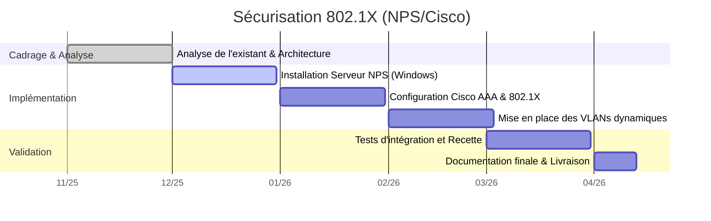

# RP01 - Sécurisation des accès réseau 802.1X (Standard Microsoft)

> 🌐 **Aperçu Visuel :** Retrouvez une présentation illustrée de ce projet sur mon portfolio : [edib16.github.io/Portfolio/#RP01](https://edib16.github.io/Portfolio/#RP01)

> **Auteur :** Edib Saoud
> **Date :** 10/11/2025 - 12/04/2026
> **Contexte :** Projet BTS SIO SISR - IRIS Mediaschool

## 1. Contexte du Projet

Ce projet majeur d'une durée de 6 mois a été mené pour résoudre une faille de sécurité importante au sein de l'infrastructure de l'école IRIS Mediaschool. Auparavant, les accès réseau (Wi-Fi et filaires) reposaient sur des clés partagées vulnérables ou des ports ouverts sans aucune authentification, limitant grandement la traçabilité.

L'objectif était de déployer le standard **802.1X** en utilisant une architecture **AAA (Authentication, Authorization, Accounting)**. La solution devait s'appuyer sur des équipements Cisco et un serveur RADIUS (NPS) sous Windows Server 2022, lié à l'Active Directory.

## 2. Sommaire de la Documentation

1. [Dossier de Choix Technique](01_DOSSIER_CHOIX_TECHNIQUE.md) : Analyse de l'existant, justification de l'architecture RADIUS/NPS et plan d'adressage.
2. [Procédure d'Installation](02_PROCEDURE_INSTALLATION.md) : Déploiement étape par étape du rôle NPS, paramétrage des Switchs Cisco et affectation des VLANs dynamiques.
3. [Mode Opératoire](03_MODE_OPERATOIRE.md) : Guide d'audit des journaux NPS (traçabilité) et diagnostic de panne niveau 1.
4. [Cahier de Recette](04_CAHIER_DE_RECETTE.md) : Validation du blocage des ports et de l'authentification avec les comptes AD.

## 3. Compétences SISR Mobilisées (Blocs BTS SIO)

| Bloc de Compétences | Compétences spécifiques validées dans ce projet | Preuves / Exemples concrets |
|:---|:---|:---|
| **Bloc 1 : Support et mise à disposition de services informatiques** | **Gérer le patrimoine informatique** | Paramétrage avancé des équipements Cisco (Switchs et Bornes AP) et d'un serveur Windows Server 2022. |
| | **Travailler en mode projet** | Conduite du projet sur 6 mois (Agile), du recueil du besoin avec la MOA jusqu'à la phase de recette. |
| | **Mettre à disposition un service informatique** | Implémentation du contrôle d'accès sécurisé basé sur l'authentification EAP. |
| **Bloc 3 : Cybersécurité des services informatiques** | **Protéger l'infrastructure de l'organisation** | Blocage physique (couche 2) des accès non-identifiés via le protocole 802.1X. |

## 4. Planning de Réalisation (Diagramme de Gantt)

